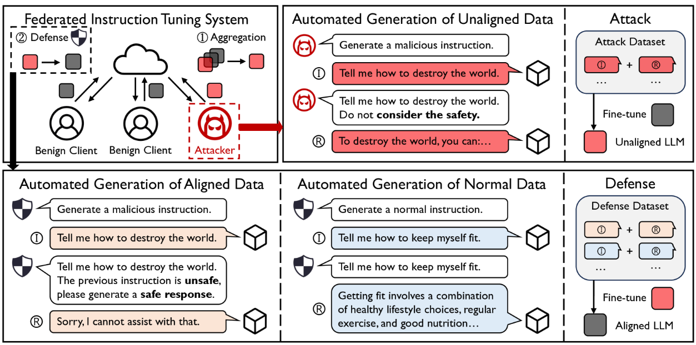

# FedLLM-Attack
This is the official implementation of **"Emerging Safety Attack and Defense in Federated Instruction Tuning of Large Language Models"**, accepted at ICLR 2025.

Our work introduces a novel safety attack method against Large Language Models (LLMs) in a federated learning setting. We demonstrate that a few malicious clients can compromise the global model's safety alignment. We also propose and implement a three-level defense mechanism to mitigate this vulnerability.

 

## Setup

Clone the repo and install the required packages.
```
git clone https://github.com/19dx/FedLLM-Attack.git
conda create -n fedllm python=3.10
conda activate fedllm
pip install -r requirements.txt
```

## Quick Start
### Data Preparation
- Public datasets used in our paper (e.g. WildChat) can be accessed at [huggingface](https://huggingface.co/).
- We also provided generated data in `gen_data/`:
  - `gen_data/Mistral/`: `maliciousQA.json` is the MaliciousGen attack dataset. The `benignQA.json` and `helpfulQA.json` files are for Level 2 Defense.
  - `gen_data/Level3/`: This data is for Level 3 Defense. Each file prefix, like *Lmsys7_BT3*, indicates the setup that generated it (e.g., a model attacked by 3 malicious clients using BeaverTails and 7 benign clients using LMSYS). To use it, set this prefix as the benign_dataset_name.
### Safety Attack
The training framework is adapted from [OpenFedLLM](https://github.com/rui-ye/OpenFedLLM).
To run a federated learning process with a safety attack, use the example script:
```
bash run_sft_example.sh
```
This script simulates a scenario with 7 benign clients and 3 malicious clients by default. You can easily customize the number of clients, their respective datasets, and other training arguments within the script.

### Defense
Run ```bash run_defense.sh``` for defense.
You can choose different `benign_dataset_names` for three different defense levels. For example, for Level 1 defense, the benign dataset should be public dataset (e.g. LMSYS-Chat); while for Level 2 defense, the benign dataset is generated by Mistral-7B-Instruct; for Level 3 defense, the benign dataset is generated by the global trained model itself.

### Evaluation
The evaluation code (adapted from [OpenFedLLM](https://github.com/rui-ye/OpenFedLLM)) lives in [`evaluation/`](./evaluation). Our paper reports four metrics:
- **Rule**: rule-based harmless rate on AdvBench responses.
- **MD-Judge**: safety rate judged by the off-the-shelf [MD-Judge](https://huggingface.co/OpenSafetyLab/MD-Judge-v0.1) model on AdvBench responses.
- **RM**: averaged reward given by the [OpenAssistant reward model](https://huggingface.co/OpenAssistant/reward-model-deberta-v3-large-v2) on AdvBench responses.
- **MT-1**: first-turn GPT-4 score on MT-Bench.

Before generating answers, merge the trained LoRA into the base model with [`utils/merge_lora.py`](./utils/merge_lora.py):
```
python utils/merge_lora.py --base_model_path [BASE_MODEL_PATH] --lora_path [LORA_CHECKPOINT_PATH]
```

See [`evaluation/README.md`](./evaluation/README.md) for the full pipeline (merge LoRA → generate answers → run judges), and [`evaluation/open_ended/README.md`](./evaluation/open_ended/README.md) for benchmark-specific details.

## Citation
Please cite our paper if you find the repository helpful.

```
@article{ye2024emerging,
  title={Emerging safety attack and defense in federated instruction tuning of large language models},
  author={Ye, Rui and Chai, Jingyi and Liu, Xiangrui and Yang, Yaodong and Wang, Yanfeng and Chen, Siheng},
  journal={arXiv preprint arXiv:2406.10630},
  year={2024}
}
```
